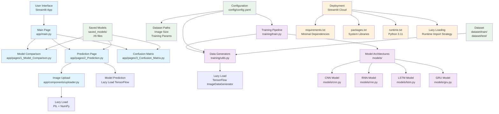

# Human Activity Prediction

A comprehensive Streamlit web application for human activity image classification using deep learning models. The project implements multiple neural network architectures (CNN, RNN, LSTM, GRU) with optimized deployment strategies for cloud platforms.

## 🏗️ Architecture Overview



## 📋 Project Structure

```
├── app/                          # Streamlit Application
│   ├── main.py                   # Main application entry point
│   ├── pages/                    # Application pages
│   │   ├── 1_Model_Comparison.py # Model performance comparison
│   │   ├── 2_Prediction.py       # Image prediction interface
│   │   └── 3_Confusion_Matrix.py # Model evaluation metrics
│   └── components/               # Reusable UI components
│       └── uploader.py           # Image upload and preprocessing
├── models/                       # Neural Network Architectures
│   ├── cnn.py                    # Convolutional Neural Network
│   ├── rnn.py                    # Recurrent Neural Network
│   ├── lstm.py                   # Long Short-Term Memory
│   └── gru.py                    # Gated Recurrent Unit
├── training/                     # Training Infrastructure
│   ├── train.py                  # Training CLI and orchestration
│   ├── evaluate.py               # Model evaluation utilities
│   └── utils.py                  # Data loading and preprocessing
├── config/                       # Configuration Files
│   └── config.yaml               # Dataset and training parameters
├── dataset/                      # Image Dataset (not included)
│   ├── train/                    # Training images by class
│   └── test/                     # Test images by class
├── saved_models/                 # Trained model artifacts
├── notebooks/                    # Jupyter notebooks (original development)
├── requirements.txt              # Python dependencies
├── packages.txt                  # System dependencies for deployment
├── runtime.txt                   # Python version specification
└── README.md                     # This documentation
```

## 🔄 Complete Workflow

### 1. **Data Preparation Phase**
- **Input**: Raw images organized by activity classes
- **Process**: Image preprocessing and data augmentation
- **Output**: Training-ready datasets with validation splits

### 2. **Model Training Phase**
- **Architectures**: CNN, RNN, LSTM, GRU implementations
- **Training**: Multi-model training with configurable parameters
- **Artifacts**: Saved `.h5` model files with trained weights

### 3. **Model Evaluation Phase**
- **Metrics**: Accuracy, precision, recall, F1-score
- **Visualization**: Confusion matrices and performance comparisons
- **Validation**: Cross-validation and test set evaluation

### 4. **Deployment Optimization Phase**
- **Lazy Loading**: Runtime import of heavy dependencies (TensorFlow, PIL, NumPy)
- **Minimal Dependencies**: Streamlit-focused requirements.txt
- **System Libraries**: Pre-installed packages for image processing
- **Cloud Compatibility**: Optimized for Streamlit Cloud deployment

### 5. **Web Application Phase**
- **User Interface**: Intuitive Streamlit-based web app
- **Features**:
  - Model comparison dashboard
  - Real-time image prediction
  - Performance visualization
  - Interactive confusion matrices

## 🚀 Deployment Strategy

### **Lazy Loading Architecture**
The application implements strategic lazy loading to prevent deployment failures:

```python
# ❌ Traditional approach (causes deployment failures)
import tensorflow as tf
import numpy as np
from PIL import Image

# ✅ Lazy loading approach (deployment-friendly)
def predict_activity(image):
    import tensorflow as tf  # Import only when needed
    model = tf.keras.models.load_model(model_path)
    # ... prediction logic

def preprocess_image(image):
    import numpy as np  # Import only when needed
    from PIL import Image  # Import only when needed
    # ... preprocessing logic
```

### **Dependency Management**
- **requirements.txt**: Minimal Python packages for core functionality
- **packages.txt**: System libraries for image processing compilation
- **runtime.txt**: Specified Python version for consistency

### **Cloud Deployment**
- **Platform**: Streamlit Cloud (share.streamlit.io)
- **Repository**: GitHub integration
- **Build Process**: Automatic dependency installation and app deployment

## 🛠️ Quick Start

### Local Development Setup

1. **Clone and Setup Environment**:
   ```bash
   git clone https://github.com/jennis1701/dla_llj.git
   cd dla_llj
   python -m venv .venv
   .\.venv\Scripts\activate  # Windows
   pip install -r requirements.txt
   ```

2. **Prepare Dataset**:
   ```
   dataset/
   ├── train/
   │   ├── running/
   │   ├── sitting/
   │   ├── eating/
   │   └── ...
   └── test/
       ├── running/
       ├── sitting/
       ├── eating/
       └── ...
   ```

3. **Train Models**:
   ```bash
   python training/train.py --all
   ```

4. **Run Application**:
   ```bash
   streamlit run app/main.py
   ```

### Cloud Deployment

1. **Push to GitHub**:
   ```bash
   git add .
   git commit -m "Ready for deployment"
   git push origin main
   ```

2. **Deploy on Streamlit Cloud**:
   - Go to [share.streamlit.io](https://share.streamlit.io)
   - Connect GitHub repository: `jennis1701/dla_llj`
   - Set main file path: `app/main.py`
   - Deploy!

## 📊 Model Architectures

### Convolutional Neural Network (CNN)
- **Architecture**: Conv2D → MaxPooling → Dense layers
- **Pre-trained Base**: MobileNetV2 feature extraction
- **Use Case**: Spatial feature extraction from images

### Recurrent Neural Networks (RNN, LSTM, GRU)
- **Architecture**: Reshaped CNN features → Recurrent layers → Classification
- **Variants**:
  - **RNN**: Basic recurrent connections
  - **LSTM**: Long-term dependency handling
  - **GRU**: Simplified LSTM with gating mechanisms

## 🔧 Configuration

### config/config.yaml
```yaml
dataset:
  train_dir: dataset/train
  test_dir: dataset/test
  image_size: 224
  batch_size: 32
  validation_split: 0.2
  seed: 42

training:
  epochs: 35
  save_dir: saved_models
```

## 📈 Performance Features

- **Multi-Model Support**: Compare CNN, RNN, LSTM, GRU performance
- **Real-time Prediction**: Instant classification results
- **Visualization**: Interactive confusion matrices and metrics
- **Scalable Architecture**: Easy addition of new models

## 🐛 Troubleshooting

### Common Issues

1. **Import Errors on Deployment**:
   - Solution: Lazy loading implemented ✓
   - Check: Dependencies loaded only when needed

2. **Memory Issues**:
   - Solution: Models loaded on-demand
   - Check: Single model in memory at a time

3. **Dataset Path Errors**:
   - Solution: Configurable paths in `config.yaml`
   - Check: Relative paths from project root

### Deployment Logs
Monitor Streamlit Cloud build logs for:
- Package installation status
- Import success/failure
- Runtime errors during app startup

## 🤝 Contributing

1. Fork the repository
2. Create feature branch: `git checkout -b feature/new-model`
3. Implement changes with lazy loading patterns
4. Test locally and ensure deployment compatibility
5. Submit pull request

## 📄 License

This project is developed for educational and research purposes in Deep Learning applications.

---

**Built with**: Streamlit, TensorFlow, Keras, scikit-learn, matplotlib, seaborn
**Deployment**: Optimized for Streamlit Cloud with lazy loading architecture
**Models**: CNN, RNN, LSTM, GRU implementations for activity classification
